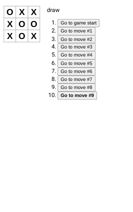

# React Tic Tac Toe

This is the completed result from this tutorial  [React Docs](https://reactjs.org/tutorial/tutorial.html).

## Table of contents

- [Overview](#overview)
- [Built with](#built-with)
- [Thoughts](#thoughts)
- [Extras](#extras)
- [Useful resources](#useful-resources)

## Overview

## Built with

- react

## What I learned

I did this after putting down React for a while.  I originally completed this tutorial before the introduction of hooks so this time I did it with hooks. 

## Extras

- [ ] Display the location for each move in the format (col, row) in the move history list.
- [x] Bold the currently selected item in the move list.
- [ ] Rewrite Board to use two loops to make the squares instead of hardcoding them.
- [ ] Add a toggle button that lets you sort the moves in either ascending or descending order.
- [ ] When someone wins, highlight the three squares that caused the win.
- [x] When no one wins, display a message about the result being a draw.

### Useful Resources 

- [Stack Overflow](https://stackoverflow.com/questions/60230221/how-can-i-update-this-state-without-mutating-the-array?rq=1) - mutation
- [Stack Overflow](https://stackoverflow.com/questions/55823296/reactjs-prevstate-in-the-new-usestate-react-hook) - prevState
- [YouTube](https://www.youtube.com/watch?v=08r9mDQvXpU) - React's tutorial with hooks implementation
- [YouTube](https://www.youtube.com/watch?v=3P8orW_DeEw) - Tic Tac Toe with hooks
- [Stack Overflow](https://stackoverflow.com/questions/58137005/tic-tac-toe-react-js-not-able-to-print-location) - print location
- [Blog](https://kyleshevlin.com/tic-tac-toe) - tic tac toe
- [TutorialsPoint](https://www.tutorialspoint.com/is-there-any-way-to-check-if-there-is-a-null-value-in-an-object-or-array-in-javascript) - checking for null
- [Stack Overflow](https://stackoverflow.com/questions/65454349/change-classname-after-mapping-a-list-react-js) - change className 
- [Medium](https://medium.com/@thekevinwang/react-%EF%B8%8F-tic-tac-toe-%EF%B8%8F%E2%83%A3-extras-88e68f025772) - tic tac toe extras class component